## このプロジェクトの目的

製造業の組立作業現場では、必要な部品や資材の在庫管理が紙や手書きのチェックシート、Excel などによって手作業で行われていました。
この作業には一度に複数人（2〜3 人）がかりで何時間もかかることもあり、作業効率の低下やヒューマンエラーの原因となっていました。

そこで、本プロジェクトでは、作業現場でリアルタイムに在庫管理ができるシステムを構築することで、工数削減とミスの防止を実現することを目的としています。
ブラウザ上から在庫の確認・使用・発注が行えるようにすることで、現場作業と在庫管理の連携をスムーズにし、属人化された業務を標準化することを目指しています。

## 使用技術一覧

<!-- シールド一覧 -->
<!-- 該当するプロジェクトの中から任意のものを選ぶ-->
<p style="display: inline">
  <!-- フロントエンドのフレームワーク一覧 -->
  
  
  <!-- バックエンドのフレームワーク一覧 -->
  
  <!-- バックエンドの言語一覧 -->
  
  <!-- ミドルウェア一覧 -->
  
  <!-- インフラ一覧 -->
  
</p>

## 目次

1. 担当範囲
2. プロジェクトについて
3. 環境
4. 開発環境構築
5. データモデル(Account)
6. API エンドポイント
7. 実際に使ってもらった指摘内容と修正内容

<!-- 担当範囲を記載 -->

## 担当範囲

-   フロントエンド（Next.js + MUI）すべて
-   バックエンド（FastAPI + PostgreSQL）設計・実装
-   Docker による環境構築

<!-- プロジェクト名を記載 -->

## プロジェクト名

### 在庫管理システム

<!-- プロジェクトについて -->

## プロジェクトについて

<!-- プロジェクトの概要を記載 -->

### システム概要図

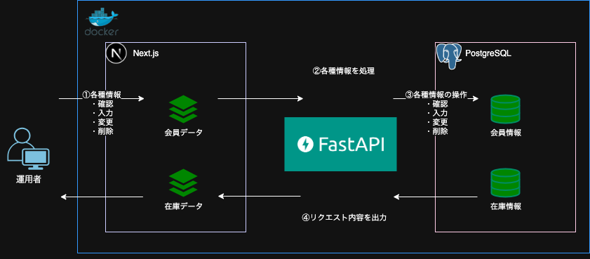

### 画面遷移図

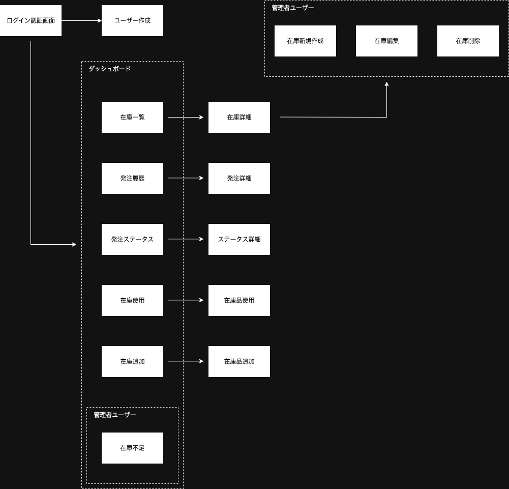

### 1.在庫一覧

在庫品目の一覧表示画面です。名前、在庫数、閾値、在庫状況が確認できます。
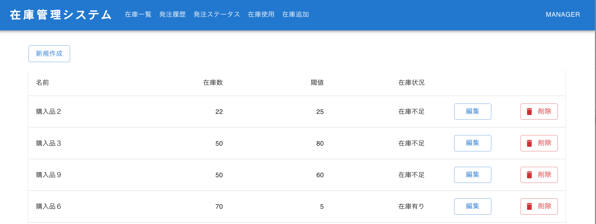

### 2.発注履歴

過去に発注されたアイテムの履歴を一覧で確認できます。発注日やス発注履歴を表示。
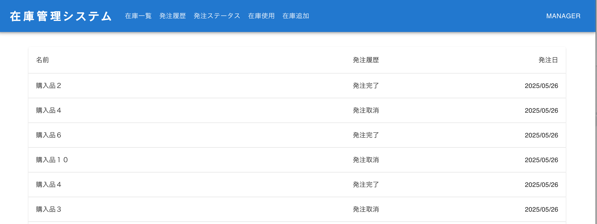

### 3.発注ステータス

発注中、発注中止、受け取り完了などのステータスが表示されます。
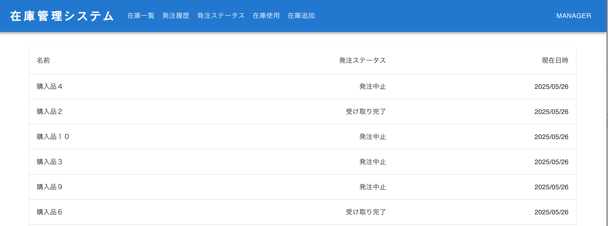

### 4.在庫使用

チェックボックスと数量を入力して在庫使用をサーバー処理します。複数の在庫を一括で使用処理できます。
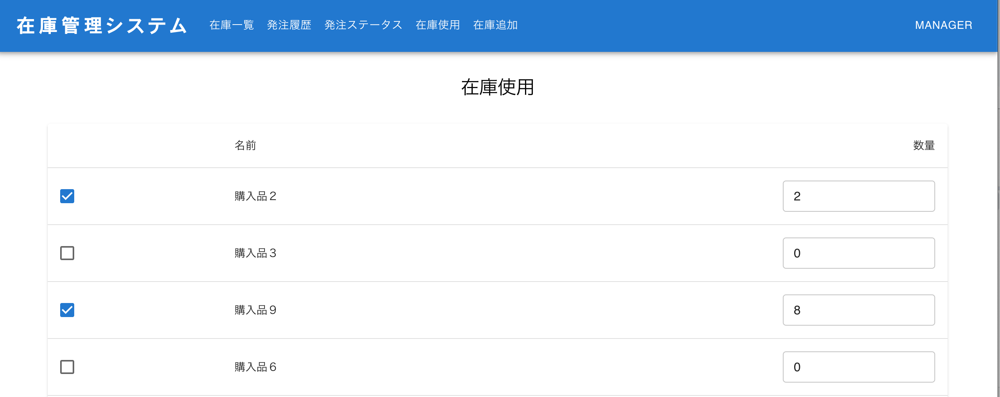

### 5.在庫追加

数量を入力して、既存の在庫に対して追加補充を行います。
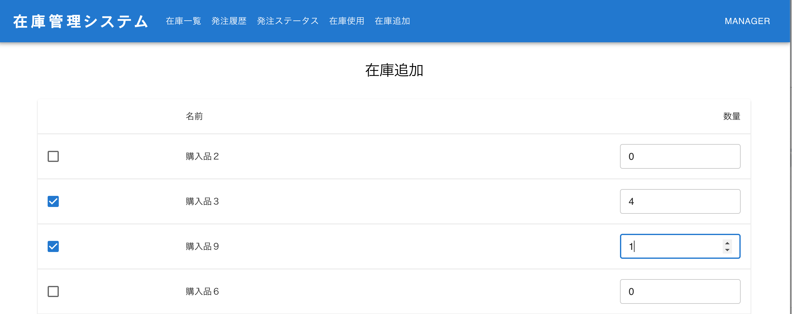

### 6.在庫不足

残数が閾値を下回った在庫品が表示され、注文処理を促します。
管理者権限のユーザーのみが閲覧可能で、在庫の発注を知らせます。
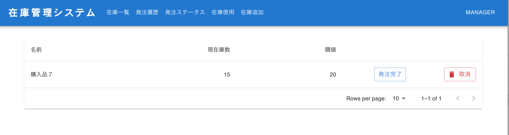

### 7.在庫管理物の新規登録

新規で在庫管理物の登録をします。
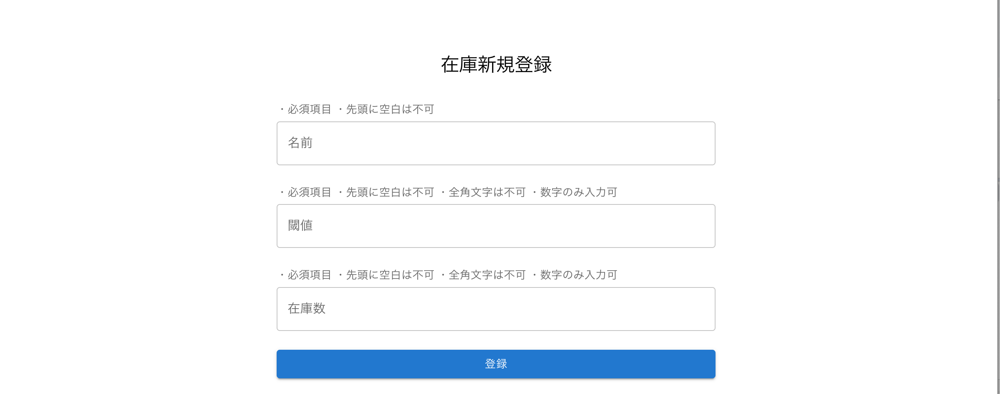

### 8.在庫管理物の編集

既存の在庫管理物に対して名前、閾値、在庫数の編集をします。
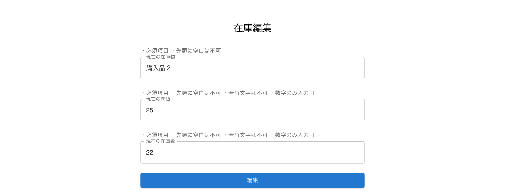

## 環境

<!-- 言語、フレームワーク、ミドルウェア、インフラの一覧とバージョンを記載 -->

| 言語・フレームワーク | バージョン |
| -------------------- | ---------- |
| Python               | 3.11.10    |
| FastAPI              | 0.115.0    |
| PostgreSQL           | 13.6       |
| React                | 19.0.0     |
| Next.js              | 15.3.0     |

<p align="left">
  <p>その他のパッケージのバージョンは requirements.txt と package.json を参照してください</p>
  <strong>※ ローカル環境での実装となっております</strong>
</p>

## 開発環境構築

<!-- コンテナの作成方法、パッケージのインストール方法など、開発環境構築に必要な情報を記載 -->

### コンテナの作成と起動

.env ファイルを以下の環境変数例と環境変数の一覧を元に作成

```env
db_host=fastapi_db_host
db_port=5432
db_name=fastapi_db_dev
master_username=fastapi_admin
master_password=fastapi_password
POSTGRESQL_SERVER=127.0.0.1
POSTGRESQL_PORT=5432
```

.env ファイルを作成後、以下のコマンドで開発環境を構築

```
docker compose up
```

### 動作確認

http://localhost:3000 にアクセスできるか確認
アクセスできたら成功

### コンテナの停止

以下のコマンドでコンテナを停止することができます

```
docker compose down
```

### 環境変数の一覧

| 変数名              | 役割                                                   | デフォルト値 | DEV 環境での値                       |
| ------------------- | ------------------------------------------------------ | ------------ | ------------------------------------ |
| `db_host`           | PostgreSQL のホスト名（Docker の DB コンテナ名と一致） | `localhost`  | `fastapi_db_host`（= db サービス名） |
| `db_port`           | PostgreSQL のポート番号                                | `5432`       | `5432`                               |
| `db_name`           | PostgreSQL のデータベース名                            | `postgres`   | `fastapi_db_dev`                     |
| `master_username`   | PostgreSQL のユーザー名                                | `postgres`   | `fastapi_admin`                      |
| `master_password`   | PostgreSQL のパスワード                                | `password`   | `fastapi_password`                   |
| `ENV`               | 実行環境の識別子（設定の切り替えに使用）               | `production` | `local`                              |
| `POSTGRESQL_SERVER` | アプリ内で使用する PostgreSQL のホスト名               | `localhost`  | `127.0.0.1`（ローカル用）            |
| `POSTGRESQL_PORT`   | アプリ内で使用する PostgreSQL のポート番号             | `5432`       | `5432`                               |
| `SECRET_KEY`        | FastAPI アプリのセキュリティ用キー（JWT などに使用）   | 空           | ランダムな文字列（推測不可の値）     |

### 補足:

<p align="left">
  <p>- POSTGRES_SERVER, POSTGRES_PORT, POSTGRES_DB, POSTGRES_USER, POSTGRES_PASSWORD は FastAPI 側から PostgreSQL に接続するための情報として使われます。</p>
  <p>- SECRET_KEY は FastAPI のセッション・JWT トークンなどの暗号化に使う重要なキーです。</p>
  <p>- ENV によって開発・本番の設定を切り替える処理をアプリケーション側で行う設計が一般的です。</p>
  <p>- .envファイルで定義された環境変数は docker-compose.yml の env_file: と environment: セクションで読み込まれ、各サービスに適用されます。</p>
</p>

## データモデル例　（Account）

```
class Account(Base):
    __tablename__ = 'account'

    id = Column(UUID(as_uuid=True), primary_key=True, index=True, default=uuid4, nullable=False)
    email = Column(String, unique=True, index=True, nullable=False)
    password_hash = Column(String, nullable=False)
    role = Column(String, nullable=False)
    created_at = Column(DateTime(timezone=True), server_default=func.now(), nullable=False)
    updated_at = Column(DateTime(timezone=True), server_default=func.now(), onupdate=func.now(), nullable=False)
    is_deleted = Column(Boolean, default=False, nullable=False)

```

## API エンドポイント

| **メソッド** | **エンドポイント**                     | **機能概要**                   |
| ------------ | -------------------------------------- | ------------------------------ |
| POST         | `/signup/`                             | アカウント登録                 |
| POST         | `/signin/`                             | ログイン認証                   |
| POST         | `/dashboard/create_items`              | 在庫物の登録                   |
| GET          | `/dashboard/read_item_list`            | 在庫一覧の取得                 |
| GET          | `/dashboard/read_item_show`            | 在庫管理物の詳細取得           |
| PUT          | `/dashboard/edit_item`                 | 在庫管理物の編集               |
| DELETE       | `/dashboard/delete_item`               | 在庫管理物の削除               |
| PUT          | `/dashboard/use_items`                 | 複数在庫品の使用処理           |
| PUT          | `/dashboard/add_items`                 | 複数在庫品の追加処理           |
| GET          | `/dashboard/read_out_stock_items_list` | 在庫不足品の一覧取得           |
| PUT          | `/dashboard/edit_out_stock_items`      | 在庫不足品の注文ステータス編集 |
| GET          | `/dashboard/read_order_history_list`   | 発注履歴の一覧取得             |
| GET          | `/dashboard/read_order_status_list`    | 発注ステータスの一覧取得       |
| GET          | `/dashboard/read_stock_list`           | 在庫使用・追加用リスト取得     |

## 実際に使ってもらった指摘内容と修正内容

指摘内容

-   在庫状況、発注履歴、発注ステータスの表示されている文字色が黒色で統一されているため、一目で状態がわかりにくい

修正点

-   在庫一覧: 在庫状況の表示の文字色を変更
    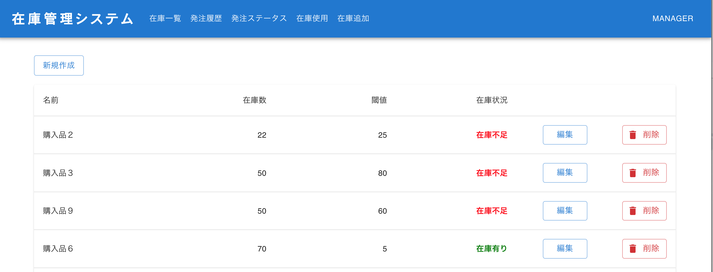
-   発注履歴: 発注履歴の表示の文字色を変更
    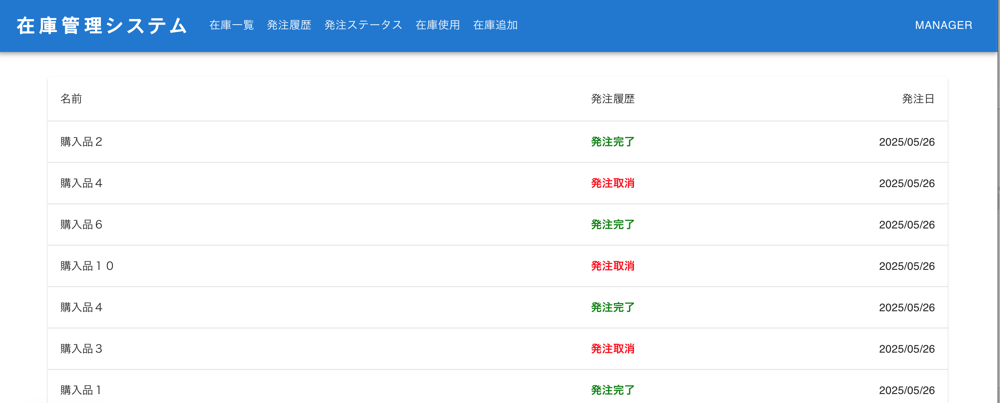
-   発注ステータス: 発注ステータスの表示の文字色を変更
    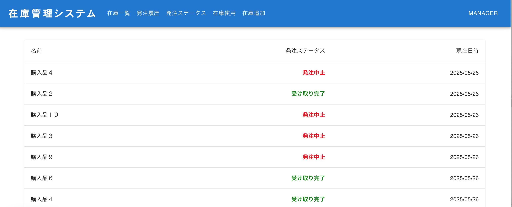
